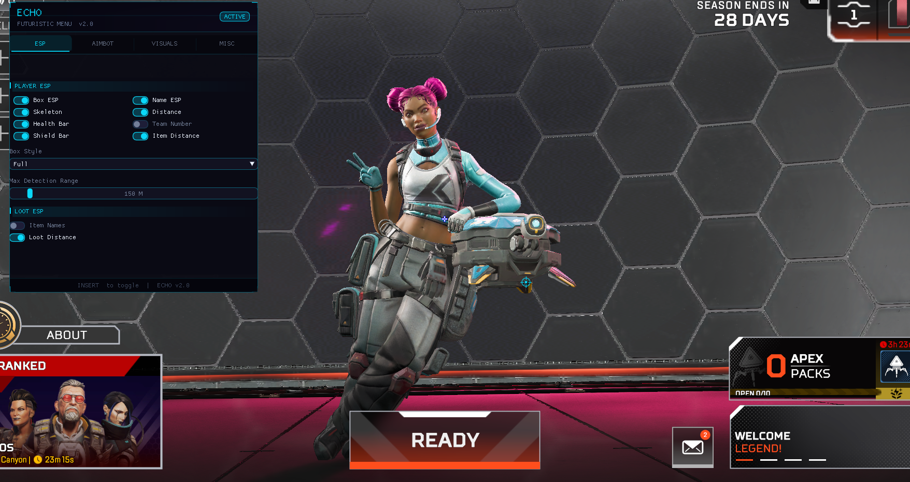
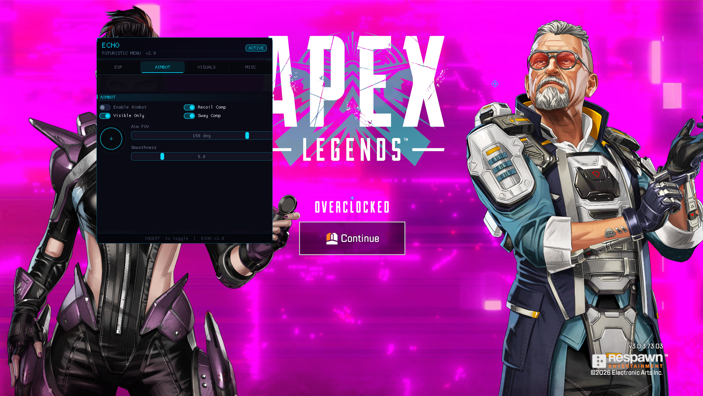
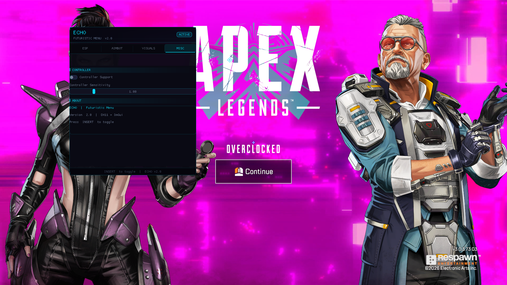
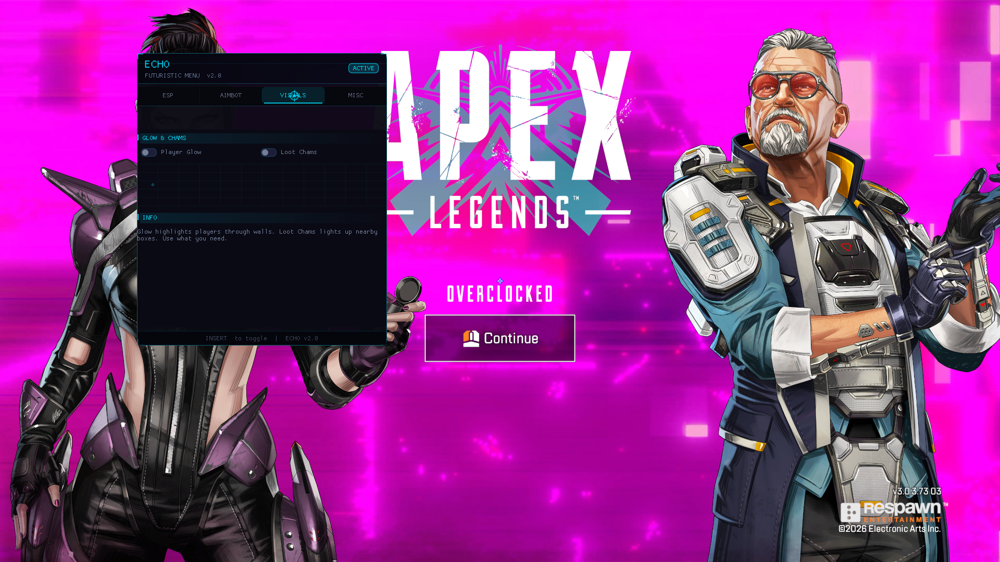

# Echo Apex - Futuristic ImGui Menu & Fully Featured Apex External

A high-performance C++ DirectX 11 external overlay base featuring a custom futuristic ImGui styling theme, optimized cache-friendly multi-thread player scanning, and build-ready dependency structures.

> **Note**: This repository contains stubbed driver communications (`include/Driver.h`). To use this in your own projects, implement your own kernel driver loading hooks or memory reader backend.

UnknownCheats (UC) Post: https://www.unknowncheats.me/forum/apex-legends/761218-echo-apex-legends-external-updated-7-7-2026-a.html

## 📸 Menu Preview

| ESP | Aimbot |
|---------|---------|
|  |  |

| Misc | Visuals |
|------|----------|
|  |  |
---

## Features

### 🎨 Futuristic ImGui Menu
* **Procedural Scanline:** Moving neon scan line effect built using raw ImGui drawing list APIs.
* **Animated Toggles:** Custom pill-style checkbox toggles with smooth state-change transitions.
* **FOV Preview Visualizer:** Dynamic crosshair circle visualization corresponding to active Aimbot configuration variables.
* **Neon Crosshair Cursor:** Fully custom neon crosshair cursor drawn on the foreground layer while the menu is toggled open.

### ⚡ Optimized Scanning Pipeline
* **Numeric Heuristics:** Eliminated high-overhead string checking and runtime string allocations (`GetSignifier`) within the main player updates.
* **Cache-Friendly Structures:** Replaced entity matching checks with cheap numeric validation checks (`life_state`, `team`, and `health` ranges).
* **Narrow Loop Boundary:** Reduced loop search complexity from a dynamic 10,000 staging map down to a lean 128 slot check.

### 🛡️ Core Integrations
* **Visuals (ESP):** Box (Full/Cornered), Bone Skeleton, Health, Shield, and Distance rendering helpers.
* **Aimbot Base:** FOV-restricted targeting, smoothing loops, and simple recoil/sway correction templates.
* **Controller Support:** Blended input structures for Xbox Controller and PlayStation 5 dual-stick configurations.

---

## Project Structure

```
Echo_Apex/
├── Echo_Apex.slnx              <- Solution configuration (Visual Studio 2022)
├── Echo_Apex.vcxproj           <- Project settings
├── src/                        <- Application entry points & overlay loops
├── include/                    <- Headers & Offsets definitions
└── imgui/                      <- ImGui DX11 + Win32 backend dependencies
```

## Getting Started

1. Open `Echo_Apex.slnx` using **Visual Studio 2022**.
2. Configure build target to `Release` / `x64`.
3. Provide your own memory communication routines inside `include/Driver.h`.
4. Update `include/Offsets.h` with the latest game base values.
5. Compile and run.

---

## Disclaimer
This project is intended strictly for educational purposes, framework study, and theme design evaluation. It does not provide bypass methods or functional cheat tools out-of-the-box.
